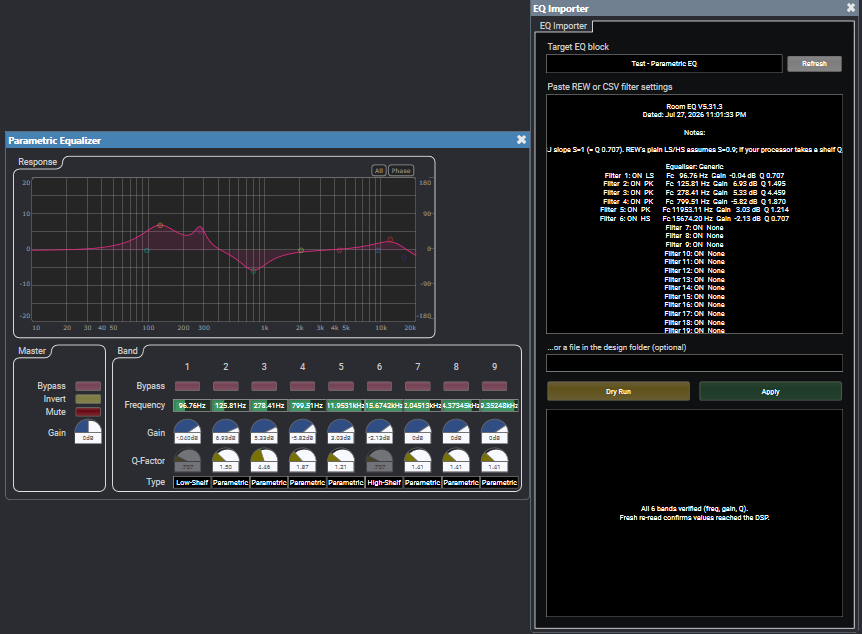
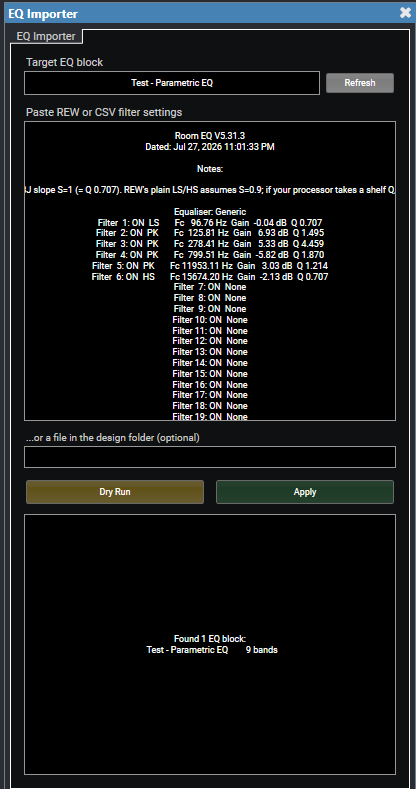
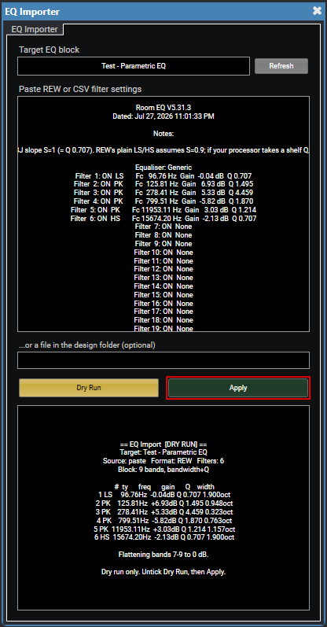
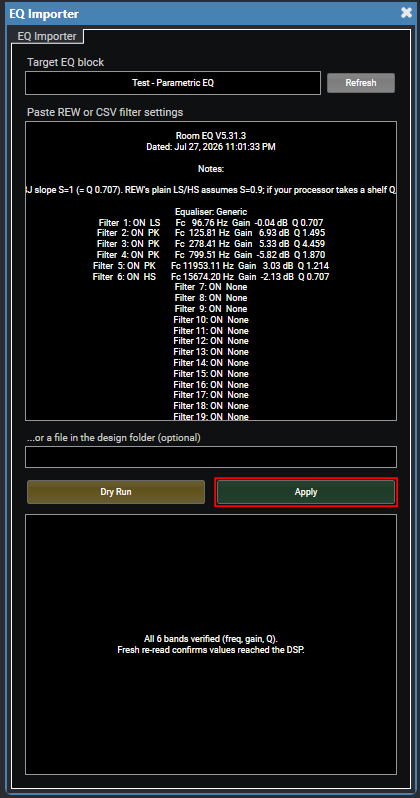

# Q-Sys EQ Filter Import Plugin

Paste a room-correction filter list into Q-Sys Designer and have it typed into a
Parametric EQ block for you - accurately, and in a form you can still adjust by hand
afterwards.



*Six filters from a REW export, written into a 9-band Parametric EQ block and read back
to confirm they landed. Every band is still a normal band you can grab and adjust.*

---

## Why this exists

Tuning software (REW and friends) hands you thirty or forty filters. Q-Sys Designer
makes you enter each one by hand: frequency, gain, and a bandwidth figure that is *not*
the Q your measurement software gave you. On a multi-zone system that is hours of typing,
and a single transposed digit is very hard to spot afterwards.

Q-Sys can import IIR biquad coefficients, but that path produces a block whose filters
can no longer be nudged by hand, which is no good during commissioning, when the whole point is
to sit in the room and adjust by ear.

This plugin takes the third route: it reads your filter list and writes it into an
ordinary Parametric EQ block. Every band stays a normal, editable band.

## What it does

- Reads **REW "Filter Settings" exports** and plain **`Type,Freq,Gain,Q` CSV**, detected
  automatically - no format switch to set.
- Converts **Q to the bandwidth-in-octaves** the block actually stores, using the RBJ
  relationship. You don't have to touch a calculator.
- Finds the EQ blocks in your design by inspecting them, so it works regardless of what
  you named them.
- **Dry Run** shows you exactly what it would write, band by band, before anything moves.
- After writing, it **reads every value back** and reports any the block clamped or
  rejected.

It is a **design-time tool**. Drop it in, import, and delete it - there is no UCI, no
runtime recall, and nothing to leave behind in a running system.

## Requirements

- Q-Sys Designer (tested on the Parametric Equalizer block, `equalizer_parametric`)
- The target EQ block's **Script Access** property set to `Script`, `External`, or `All`

## Installation

1. Download the latest `.qplug` from the
   [Releases page](https://github.com/niconathanson/qsys-eq-importer/releases/latest).
2. Copy it into your Q-Sys plugin folder:

   ```
   %USERPROFILE%\Documents\QSC\Q-Sys Designer\Plugins
   ```

3. Restart Q-Sys Designer. The plugin appears in the schematic library under **Tools →
   EQ Importer**.

## Using it



1. Drag **EQ Importer** into your schematic and open its control panel.
2. Press **Refresh**. Every EQ block in the design is listed with its band count. Pick
   your target from the dropdown.
3. Paste your filter list into the **Filter Data** box. (Or, if the file is sitting in
   the design's own folder, type its name in the file box instead.)
4. Tick **Dry Run** and press **Apply**. Read the table it prints - every band, with the
   Q from your file and the octave width it will write.

   

   Nothing has been touched at this point. The `width` column is the conversion: the
   0.707 shelf Q at the top of the file becomes 1.900 octaves, which is what the block
   actually stores.

5. Untick **Dry Run** and press **Apply** for real. The status pane confirms each band
   was written, then re-reads them through a fresh connection to prove the values
   reached the DSP rather than just the script:

   

Any bands beyond the ones your file uses are flattened to 0 dB, so you never end up with
leftovers from a previous import.

## Supported input formats

**REW filter settings export**: paste the file as-is, header and all:

```
Filter  1: ON  HS       Fc 15203.89 Hz  Gain   0.98 dB  Q 0.707
Filter  2: ON  LS       Fc   79.37 Hz  Gain  -0.37 dB  Q 0.707
Filter  3: ON  PK       Fc   84.38 Hz  Gain   6.99 dB  Q 4.194
```

**Generic CSV**: from a spreadsheet or any other tool:

```
Type,Freq(Hz),Gain(dB),Q
HS,15203.89,0.98,
PK,84.38,6.99,4.194
```

Type names are matched loosely: `PK`, `PEQ`, `Peaking` and `Bell` all mean the same
thing, as do `LS` / `Low Shelf` / `lowshelf`.

Working examples of both are in [`samples/`](samples/).

## Things worth knowing

**Band count is fixed before you start.** The number of bands is a *property* of the EQ
block, and no script can change it, which is a Q-Sys restriction, not a limitation here.
If your file has more filters than the block has bands, the import stops without writing
anything and tells you the number to set. Set it in the block's Properties and Apply
again.

**Only peaking and shelving filters can be imported.** High-pass, low-pass, notch and
all-pass filters have no equivalent in the Parametric EQ block. They are listed in the
status pane and skipped - never silently approximated into something else.

**Shelves without a Q default to 0.707.** REW's plain low/high shelves assume slope
S=0.9; FIREQ designs at S=1, which is Q=0.707. When your file gives no Q for a shelf,
0.707 is used to match the FIREQ-predicted curve. If your file *does* specify a shelf Q,
that value is used as-is.

**Q versus bandwidth.** The block stores width in octaves; measurement software speaks
in Q. The conversion is

```
N_octaves = (2 / ln2) · asinh(1 / 2Q)
```

which was checked against the block's own defaults (1.00 octave ↔ Q 1.41421365). After
writing, the plugin reads the width back through whichever control the block treats as
live and compares it to your file, so a conversion error would be caught rather than
quietly shipped.

## If something doesn't work

**"No EQ blocks found in this design."** The block's **Script Access** property is
probably still `None`. Set it to `Script` (or `External` / `All`) and press Refresh.

**"STOPPED: needs 24 bands, block has 16."** Open the EQ block's Properties and raise
the band count to at least the number given, then Apply again. Nothing was written.

**"No filters recognised."** The paste didn't look like either format. Check you copied
the filter lines themselves, not just the file header.

**A gain came back different from the file.** The block clamped it - Parametric EQ bands
have a gain limit. The status pane flags which band, and the value is genuinely at the
block's ceiling.

## License

[MIT](LICENSE) - free to use, modify and redistribute, commercially or otherwise.
